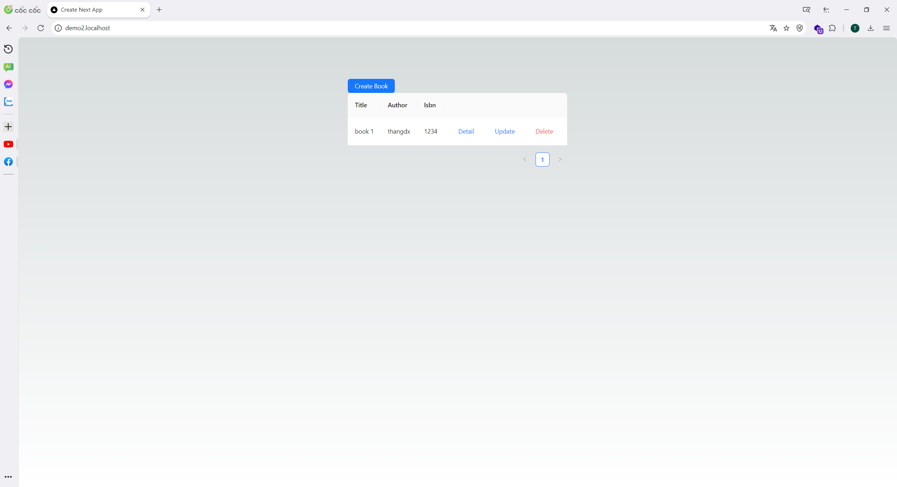

# CRUD Book

A brief description of what this project does and who it's for.

## Description



This project is built using NestJS, Next.js, Prisma, and GraphQL. It is designed to demonstrate a full-stack application with a React frontend (Next.js), a Node.js backend (NestJS), a database ORM (Prisma), and a flexible data querying language (GraphQL).

### Features

- Next.js for server-side rendering and static site generation.
- NestJS for building efficient and scalable server-side applications.
- Prisma as a next-generation ORM for Node.js and TypeScript.
- GraphQL for declarative data fetching.

## Getting Started

### Prerequisites

- Node.js v18
- npm or yarn
- PostgreSQL or any database supported by Prisma

### Installation

1. Clone the repository

   ```bash
   git clone https://github.com/thangyt01/next-nest-book.git
   ```

2. Cd to infra

   ```bash
   cd infra
   ```

3. Run docker compose

   ```bash
   docker-compose up -d
   ```

4. Run Prisma migrations in api container

   ```bash
   docker exec -it infra-api-1 npx prisma migrate deploy
   ```

5. Generate GraphQL by codegen

   ```bash
   cd frontend
   yarn generate
   ```

6. Visit http://demo2.localhost in your browser to view the application.
   **note:** To add virtual hosts like `demo1.localhost` and `demo2.localhost` to your `/etc/hosts` file on a Linux or macOS system, you can follow these steps:

   ```bash
   sudo nano /etc/hosts

   # add this line
   127.0.0.1   demo1.localhost
   127.0.0.1   demo2.localhost
   ```

## Usage

Explain how to use your project, including examples of commands or screenshots if applicable.

## Contributing

Contributions are always welcome! Please read the CONTRIBUTING.md file for details on our code of conduct, and the process for submitting pull requests to us.

## License

This project is licensed under the MIT License - see the LICENSE.md file for details.

## Acknowledgments

Hat tip to anyone whose code was used
Inspiration
etc
